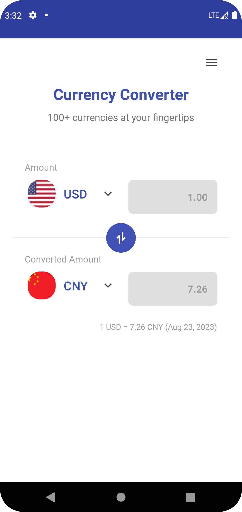
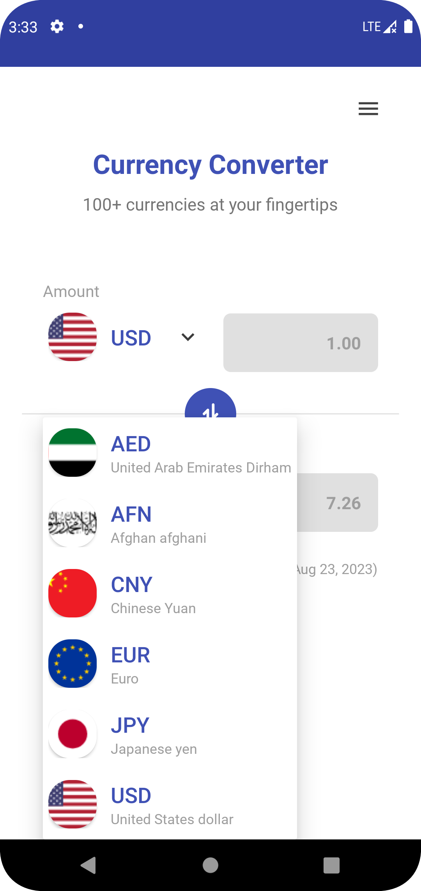
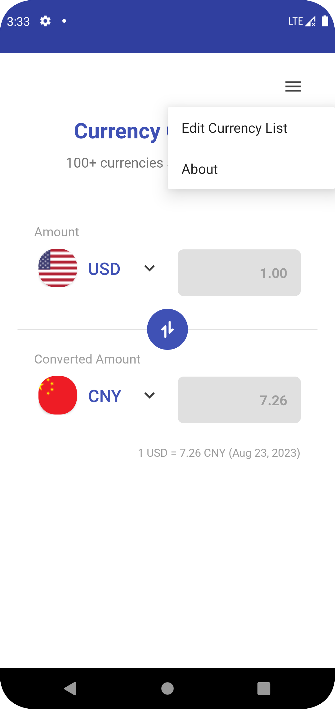
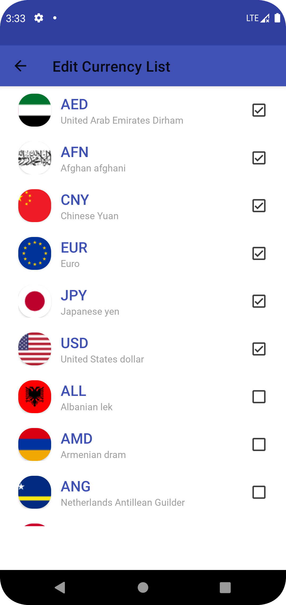

# Currency Converter

Currency Converter is a simple android application that converts currencies using the [Currency API](https://github.com/fawazahmed0/currency-api). The API provides daily currency exchange rates and Currency Converter stores the latest rates locally so that it can be used offline.

<table><tr>
    <td></td>
    <td></td>
    <td></td>
    <td></td>
</tr></table>